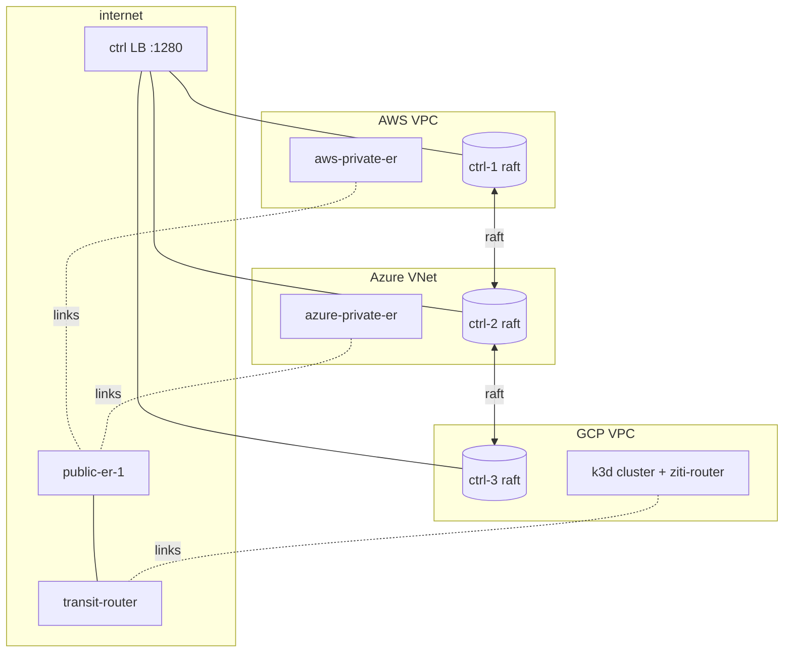
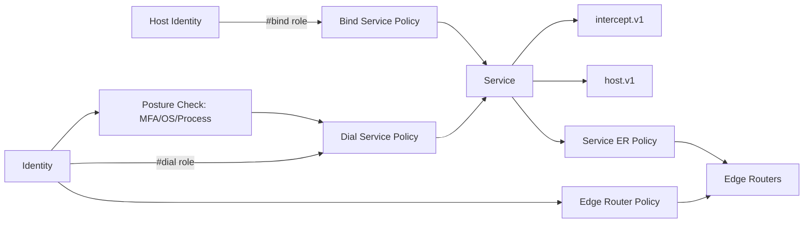

# The Most Fucking Complicated OpenZiti Docker Demo (working title: `ziti-overkill`)

> Goal: a single-repo, mostly-one-command-up, deliberately over-engineered OpenZiti deployment that exercises
> *everything* - clustered HA controllers, many routers across emulated clouds, Kubernetes, every enrollment
> method, every tunneler/edge (including Windows/macOS/Linux), full CLI tour, diagrams, docs, and runnable demos.

This document is the master plan. It is intentionally aggressive in scope. Sections marked **Question:** need your
input before I lock the design. Answer them in the **Answers** block at the bottom. Everything else I will treat as
a sane default and proceed.

---

## 1. Design principles

- **One repo, layered compose.** A base `docker-compose.yml` plus overlay files (`compose.clouds.yml`,
  `compose.k8s.yml`, `compose.edges.yml`, `compose.observability.yml`) so you can bring up subsets or the full
  monster. A top-level `Makefile` / `up.ps1` orchestrates.
- **Logic in scripts, not in compose or CI.** Every step (PKI, enrollment, service creation, demos) is a
  PowerShell or bash script runnable locally and idempotent. Compose/CI only invoke scripts. (Matches your global
  rule about workflows.)
- **Emulate the internet and clouds with Docker networks**, not real cloud accounts. Each "cloud" is an isolated
  bridge network; a NAT/router container bridges them to a shared `internet` backbone. Optional real-cloud
  appendix later.
- **Reproducible PKI and config.** Generated once into a `pki/` and `config/` volume, version-pinned ziti images.
- **Self-documenting.** Every script echoes the exact `ziti` CLI commands it runs so the logs *are* the tutorial.

---

## 2. Emulated network topology

We model the internet as a backbone with several "sites" hanging off it. Each site is its own Docker network with
its own address space, and a gateway/NAT container in front so traffic between sites looks like it crosses the
public internet (public edge routers get a routable presence on `internet`; private nodes do not).

```
                                  ┌─────────────────────────────────────┐
                                  │            internet (backbone)        │
                                  │            10.255.0.0/16              │
                                  └───┬─────────┬──────────┬──────────┬──┘
                       public ER /    │         │          │          │
                       ctrl LB        │         │          │          │
            ┌───────────────────┐  ┌───┴────┐ ┌──┴─────┐ ┌──┴─────┐ ┌──┴───────┐
            │ AWS us-east-1 VPC │  │ Azure  │ │  GCP   │ │ Home   │ │ Corp DC  │
            │ 10.10.0.0/16      │  │ westeu │ │ uscen  │ │ LAN    │ │ on-prem  │
            │                   │  │ 10.20  │ │ 10.30  │ │ 192.168│ │ 10.40    │
            │ ┌───────────────┐ │  │        │ │        │ │ .50.0  │ │          │
            │ │ ctrl-1 (raft) │ │  │ ctrl-2 │ │ ctrl-3 │ │ ZDEW   │ │ private  │
            │ │ public ER     │ │  │ priv ER│ │ k8s    │ │ (your  │ │ ER +     │
            │ │ k8s edge      │ │  │ linux  │ │ cluster│ │ Windows│ │ servers  │
            │ └───────────────┘ │  │ edge   │ │ +ziti  │ │ host)  │ │          │
            └───────────────────┘  └────────┘ └────────┘ └────────┘ └──────────┘
```

Sites and what lives in each:

| Site (Docker network) | CIDR | Role | Key nodes |
|---|---|---|---|
| `internet` | 10.255.0.0/16 | Public backbone | controller LB, public edge routers, transit router |
| `aws-vpc` | 10.10.0.0/16 | Cloud A (public+private subnets) | controller node 1, public ER, private app server, k8s edge |
| `azure-vnet` | 10.20.0.0/16 | Cloud B | controller node 2, private ER, Linux edge tunneler |
| `gcp-vpc` | 10.30.0.0/16 | Cloud C | controller node 3, k8s cluster (k3d), ziti-router helm |
| `home-lan` | 192.168.50.0/24 | Your house | ZDEW on the real Windows host (bridged), a private printer/service |
| `corp-dc` | 10.40.0.0/16 | On-prem datacenter | private ER, legacy app servers, updb/CA enrollment demo |

**Question 1 (topology size):** The full set is 3 controllers + ~6 routers + k8s + multiple edges + servers. That
is roughly 18-25 containers plus a k3d cluster. Is that within your host's budget, or should I ship a `--lite`
profile (1 controller, 2 routers, no k8s) as the default and gate the full monster behind a flag?

**Answer:**
Can we do both? Or can we split it somehow? I have a pretty beefy dev machine and docker containers tend to be lite weight. it should be fine???


**Question 2 (multi-host):** Is this all on one beefy machine, or do you want it to span multiple physical hosts
(e.g. your Windows box + a Linux box + a Mac)? Single-host changes nothing; multi-host means I add Docker Swarm or
explicit `advertise` addresses and a routable overlay.

**Answer:**
Answered before but you know - all of the above if we can. the goal is to make as complex of a 'learning system' that i can.
after that if i need to split it across actual hosts -- ok... we can cut stuff to accomodate. it should be EASY to split though,
like i would WANT to be able to __EASILY__ carve off blocks and move them. that's part of the power of openziti is running this
shit anywhere

---

## 3. OpenZiti control plane (HA controller cluster)

- **3-node raft controller cluster** (`ctrl-1` in aws, `ctrl-2` in azure, `ctrl-3` in gcp) to demonstrate real HA,
  leader election, and quorum survival. We deliberately split them across "clouds" so we can kill a cloud and show
  the network survives.
- A small **controller load balancer** container (HAProxy or nginx stream) on `internet` fronting the client API,
  to show clients using a stable endpoint while the backend cluster reshuffles.
- Demo script that: shows `ziti agent cluster list`, kills the leader, shows re-election, restarts, shows rejoin.



**Question 3 (HA maturity):** I will target the current OpenZiti HA/clustering as documented at the version we pin.
Do you want me to pin a specific `ziti` version (and controller/router image tag), or always track `latest`? Pinning
makes the demo reproducible; latest keeps it bleeding-edge. Default: pin, with a one-line var to bump.

**Answer:**
practically, it needs to be 'whatever fucking version i tell you to run'. maybe via a .env file (with default being the latest
release in github)


---

## 4. Data plane (routers)

Router roster, chosen to exercise every router shape:

| Router | Site | Type | Notable feature demoed |
|---|---|---|---|
| `public-er-1` | internet | edge + link listener | public entry point, WSS + TLS listeners |
| `transit-router` | internet | fabric/transit (no edge) | pure fabric routing, smart routing, link cost |
| `aws-private-er` | aws | private edge | tunnel mode, hosts an app via `host.v1` |
| `azure-private-er` | azure | private edge | enrolled via different method, traversal-only |
| `corp-private-er` | corp-dc | private edge | fully private, reachable only via links |
| `k8s-er` | gcp/k8s | edge in k8s (helm) | router as a pod, ziti-router Helm chart |

Demos: link formation across "clouds", `ziti fabric list links`, `ziti fabric list circuits`, terminator
strategies, smart routing cost manipulation, killing a transit router and watching circuits re-route.

**Question 4 (router count):** Six routers is the sweet spot for "complicated but comprehensible." Want me to push
it higher (e.g. two public ERs behind the LB, multiple transit routers for a real mesh) for maximum chaos? Default:
six as above, with comments showing how to scale.

**Answer:**
What i really want from the routers is __CLEAR PATHING__. So the idea would be to have something like:
home user -> 'internet' -> 'vpc1' -> 'vpc2' where the home user is trying to access something in vpc2. that's important
because i want to see the 'long path'. i also would ideally prefer each to be redundant legs so that the path might
recalculate. i furthermore would then want to use 'link groups' so that vpc2 is __ONLY__ acessible from vpc1, then i 
would want to layer on SERPs and show that even a router in vpc1 can't host a service that it's not in the SERP for
etc etc. but again all this nees to be modular so that i can pick a piece up and move it around.

---

## 5. Identities, enrollment methods, and policies (the "show EVERYTHING" part)

We will demonstrate **every enrollment method** with a dedicated identity each, so the demo literally walks through
all of them:

1. **OTT** (one-time token) - classic `ziti edge create identity ... -o file.jwt` then enroll.
2. **OTT + CA (ottca / 3rd-party CA)** - enrollment validated against a registered CA.
3. **CA auto-enrollment** - register a CA, auto-enroll any cert signed by it, no per-identity token.
4. **UPDB** (username/password) - `ziti edge create authenticator` / updb enrollment for the admin and a user.
5. **x509 third-party CA** - bring-your-own client cert.
6. **Transit/router enrollment** - router enrollment tokens.

Plus the policy model, fully exercised:

- **Service policies** (Bind and Dial) with attribute-based selectors (`#roles`).
- **Edge router policies** and **service edge router policies** (controlling which ERs can carry which services).
- **Posture checks**: MAC, OS/domain, process, MFA (TOTP) - we will wire MFA on at least one high-value service and
  show the prompt flow on ZDEW.
- **Config types**: `intercept.v1`, `host.v1`, plus a tunneler client/server config for legacy examples.



**Question 5 (enrollment breadth):** Confirm you want all six enrollment methods as separate, scripted walkthroughs
(it is more setup but it is the whole point of "EVERYTHING"). Default: yes, all six.

**Answer:**
All of them that you can find  including the funky shit that docker can do because of container network mode, the whole
--network container:<container_name_or_id> sort of thing. i want to consider "run-host" and be able to configure routers
with and without tunneler enabled all that shit


---

## 6. Edges / tunnelers across operating systems

This is the part Docker alone cannot fully do, so it needs your call.

| Edge | How it runs | Enrollment | Notes |
|---|---|---|---|
| Linux `ziti-edge-tunnel` | Docker container (easy) | OTT | tproxy/dns intercept inside its site |
| Linux SDK app | Docker container | OTT/CA | a tiny Go/Python SDK service, no tunneler |
| Kubernetes tunneler | k3d pod (ziti-host / CNI) | OTT | sidecar injection or ziti-host pattern |
| **Windows Desktop Edge (ZDEW)** | **your real Windows host** | OTT (QR/jwt) | cannot containerize; runs on `home-lan` |
| **macOS Desktop Edge** | a real Mac (if available) | OTT | same constraint as Windows |
| Mobile (Android/iOS) | optional, real device | OTT QR | nice-to-have screenshots only |

The Docker networks will be reachable from your Windows host so ZDEW can actually dial services in the emulated
clouds (via the public ER published on a host port).

**Question 6 (macOS):** Do you have a Mac available to include the macOS Desktop Edge live, or should I document it
with screenshots/instructions only and keep the runnable edges to Linux + k8s + your Windows ZDEW?

**Answer:**
yes i have a mac but i just want that documented. don't need screenshots really just want to see it acutally work.
it'll be important that the controllers are of course accessible from all machines on the network. i have this shit
locally but we might need to iterate to get that part 'just right' for "lan dev" (where the controller is NOT globally accessable)


**Question 7 (Windows host integration):** For ZDEW to dial into the demo, the public edge router needs a host-port
published from Docker (e.g. `0.0.0.0:8441`). Are you OK with the demo publishing a couple of ports on your Windows
machine, or do you want everything kept strictly inside the Docker network (which would limit ZDEW to a Linux VM)?

**Answer:**
Assume the user is able to figure that out.  In practically i'll NEED to do this since my mac is a physical machine, so
sorta have to be able to do that...

---

## 7. Kubernetes in the mix

- **k3d** (k3s-in-Docker) so the whole cluster lives in the same Docker engine. Spun up by a script, not by hand.
- Deploy via the official **OpenZiti Helm charts**: `ziti-controller` is external (our raft cluster), and inside
  k8s we deploy a **`ziti-router`** (the `k8s-er`) and the **`ziti-host`** / tunneler for pod-to-service access.
- Demo a real app in k8s (e.g. a simple web app) exposed *only* over Ziti (no Ingress, no NodePort), dialed from
  the Linux tunneler and from ZDEW.
- Optionally the **admission webhook / sidecar injection** pattern to auto-Ziti-enable pods.

**Question 8 (k8s flavor):** k3d is my default (lightest, pure Docker). Acceptable, or do you specifically want
`kind` or `minikube`? And do you want the sidecar-injection webhook demo, or is the simpler ziti-host pattern
enough? Default: k3d + ziti-host, with webhook as a documented bonus.

**Answer:**
k3d works for me


---

## 8. Demo applications and scenarios

Concrete things to dial, so the network actually *does* something visible:

- **Cross-cloud web app**: app in AWS VPC, dialed from Azure Linux edge and from ZDEW. Shows zero open ports.
- **Database over Ziti**: a Postgres in corp-dc, reachable only via private ERs, dialed by an app in aws.
- **k8s app**: web service in k3d, dialed from outside the cluster with no ingress.
- **MFA-gated service**: a "sensitive" admin panel requiring TOTP via ZDEW posture check.
- **Resilience demo**: kill controller leader / kill a transit router, watch traffic continue / re-route.
- **Dark services everywhere**: `nmap` from the `internet` backbone proving nothing is listening publicly.

Each scenario gets a script (`demos/NN-name.ps1` + `.sh`) and a doc page with expected output.

**Question 9 (hero demo):** Which single scenario is the "money shot" you most want to demo to an audience? I will
polish that one to a fully narrated, copy-pasteable walkthrough and keep the rest as solid-but-terser scripts.
Default if unanswered: the cross-cloud + MFA web app.

**Answer:**
what i really want is a fucking littany of examples. here's how you ssh, here's exposing a web server, here's how you make 
bespoke paths for your home -> internet -> vpc1 -> vpc2 service... i mean i want so much shit that i'm overwhelmed

---

## 9. Observability and "look how complicated it is" dashboards

- **Prometheus + Grafana** scraping controller and router metrics, with a prebuilt Ziti dashboard.
- **A topology visualizer**: either the Ziti console (ZAC) and/or a live `ziti fabric` graph rendered to SVG.
- Centralized logs (Loki or just `docker compose logs` with good prefixes).

**Question 10 (console):** Include the **Ziti Admin Console (ZAC)** web UI container? It makes the demo much more
clickable. Default: yes.

**Answer:**
yes definitely. also install them on each of the controller nodes so they all have it. i'd also really like the 
demo to have JUST ONE memorable name and be behind HA Proxy if possible along with all the routers maybe? (we can
iterate on that idea maybe)

---

## 10. CLI tour (the full `ziti` surface)

A `docs/cli-tour.md` plus a runnable `demos/00-cli-tour.sh` that touches, with commentary:
`ziti edge` (login, identities, services, policies, posture, enrollment, MFA), `ziti fabric` (routers, links,
circuits, terminators), `ziti ops` / `ziti agent` (cluster, pprof, controller/router introspection), `ziti pki`
(the CA/cert lifecycle), and `ziti` quickstart-style helpers. Every command is shown with real output.

---

## 11. Repo layout (proposed)

```
ziti-overkill/
  README.md                      # the front door + the big diagram
  complicated.plan.md            # this file
  Makefile / up.ps1 / up.sh      # orchestration entrypoints
  .env.example                   # versions, CIDRs, ports
  compose/
    docker-compose.yml           # controllers + core routers
    compose.clouds.yml           # network/site definitions + NAT gateways
    compose.k8s.yml              # k3d bootstrap helpers
    compose.edges.yml            # linux/sdk edges
    compose.observability.yml    # prom/grafana/zac/loki
  scripts/
    00-pki.sh / .ps1             # generate PKI
    10-bootstrap-controllers.*   # raft cluster init
    20-enroll-routers.*          # all router enrollment
    30-identities-enrollment.*   # all six enrollment methods
    40-services-policies.*       # services, configs, policies, posture
    50-k8s.*                     # k3d + helm
    lib/                         # shared helpers, echo-the-command wrappers
  demos/
    00-cli-tour.* ... NN-*.{sh,ps1}
  docs/
    architecture.md, networking.md, enrollment.md, ha.md, k8s.md,
    edges-windows.md, edges-macos.md, troubleshooting.md
    diagrams/ (mermaid sources + rendered svg)
  pki/  config/  (generated, gitignored)
```

**Question 11 (primary OS for scripts):** You are on Windows but the containers are Linux and you also mentioned
Linux/macOS hosts. Do you want **PowerShell as the canonical script language** (with bash equivalents), or **bash
canonical** (with a PowerShell wrapper)? Default: bash canonical for in-container/CI portability, PowerShell
wrappers for you to run natively on Windows.

**Answer:**
let's make a container that is JUST for this sort of shit. for example this conctainer
docker run --rm -it openziti/quickstart:latest bash has all sorts of tooling in it already and it takes this questions
off the table

---

## 12. Extras worth including (tell me yes/no)

- **zrok** (built on Ziti) for a public-sharing demo.
- **BrowZer** for clientless, browser-based access to a web app (no tunneler at all).
- **An SDK app per language** (Go + one of Python/C#/JS) to show app-embedded zero trust.
- A **chaos script** that randomly kills nodes to prove resilience.

**Question 12 (extras):** Which of zrok / BrowZer / SDK apps / chaos do you want in v1? Default: include BrowZer and
a Go SDK app; defer zrok and chaos to a v2 appendix.

**Answer:**
browzer is dead. no browzer. zrok is an add on for later yes. but not now. sdk app per language yes but they all should
be THE SAME APP. probably some sofrt of echo client/server since that tends to be the easiest but 
we would definitely use this to educate people on fancier apps like web servers etc later. yes a chaos scripot that fucks
with routers, slows them down to a crawl all that sort of thing yes. it's an add on too.. it needs to be stable for the
most part but be able to bring the monkey it when we need him

---

## 13. Build order (how I will actually execute, once questions are answered)

1. Skeleton repo + `.env` + base compose + PKI script. Bring up a single controller, verify.
2. Expand to 3-node raft cluster + LB. HA demo working.
3. Add core routers (public, transit) + links. Fabric demo working.
4. Add cloud networks + private routers. Cross-site links working.
5. Identities + all enrollment methods + policies + first service. First dial working.
6. Linux + SDK edges, then k8s (k3d + helm). k8s dial working.
7. ZDEW (and macOS) integration + MFA posture. Desktop dial working.
8. Observability + ZAC + dashboards.
9. Demos, docs, diagrams, CLI tour. Polish hero demo.

I will land these as incremental, reviewable commits, each independently bring-up-able.

---

## 14. Defaults I will assume unless you say otherwise

- Local-only emulation (no real cloud accounts).
- Pinned ziti version.
- bash canonical scripts + PowerShell wrappers.
- k3d for Kubernetes; ziti-host pattern.
- ZAC console included; Prometheus/Grafana included.
- All six enrollment methods.
- Full monster behind a flag, `--lite` as friendlier default if your host is small.
- Self-signed PKI generated by `ziti pki`.

---

## Answers (fill these in - I will read them and proceed)

- **A1 (topology size / lite profile):**
- **A2 (single vs multi host):**
- **A3 (pin version vs latest; which version):**
- **A4 (router count: six vs more):**
- **A5 (all six enrollment methods?):**
- **A6 (macOS available live?):**
- **A7 (OK to publish host ports for ZDEW?):**
- **A8 (k8s flavor + webhook?):**
- **A9 (hero demo scenario):**
- **A10 (include ZAC console?):**
- **A11 (script language canonical):**
- **A12 (extras: zrok / BrowZer / SDK / chaos):**
- **Anything else / hard constraints (RAM, CPU, time budget):**
