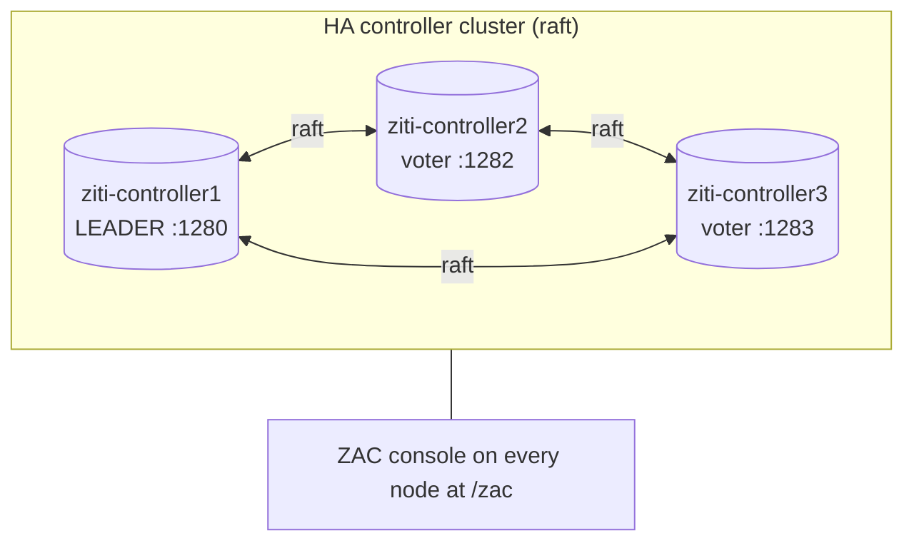
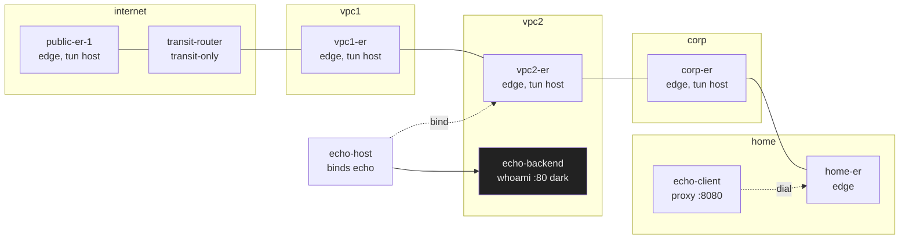
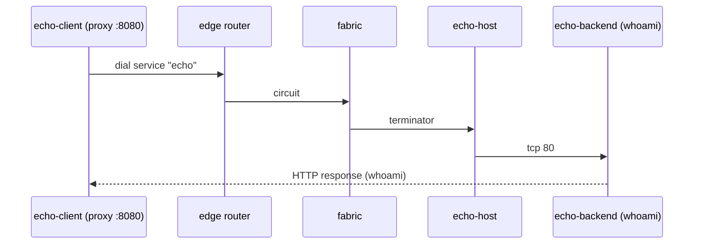
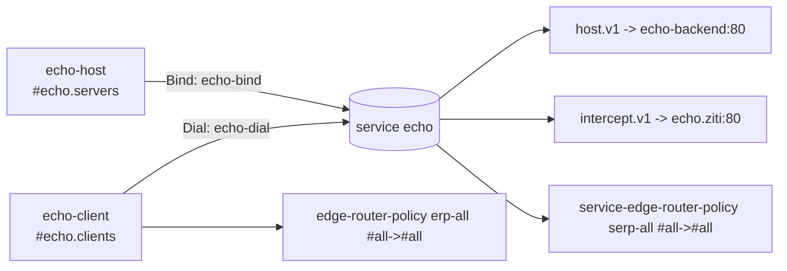

# Architecture (as built)

Live topology of the `ziti-overkill` lab. This reflects what is actually running, not the aspirational plan.

## Control plane

- 3-node raft cluster. One leader, two voters. Each node also serves the edge/management/fabric APIs and ZAC.
- PKI bootstrapped by node 1; nodes 2/3 chain to node 1's root, so the root CA is common.

## Data plane (routers + emulated sites)

Every router attaches to the `ziti` control network (to reach the controllers) plus the site network(s) it
represents. The fabric currently forms a FULL MESH (15 links) because routers can all reach each other over `ziti`.

## Echo service path (first dial)

## Identities and policies (echo)

## Ports (host-published)

| Service | Host port |
|---|---|
| ziti-controller1 (API + ZAC) | 1280 |
| ziti-controller2 | 1282 |
| ziti-controller3 | 1283 |
| public-er-1 | 3022 |
| transit-router | 3023 |
| vpc1-er | 3024 |
| vpc2-er | 3025 |
| corp-er | 3026 |
| home-er | 3027 |
| echo-client proxy | (internal :8080) |
