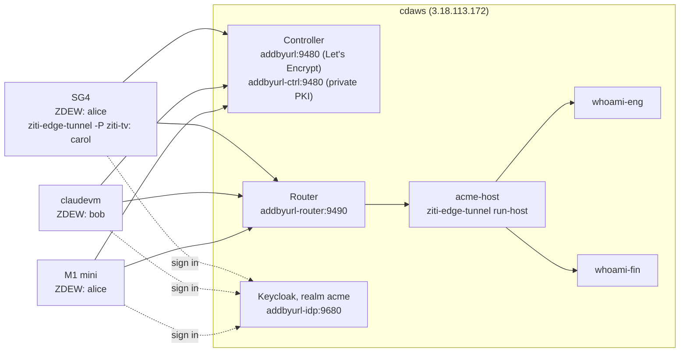
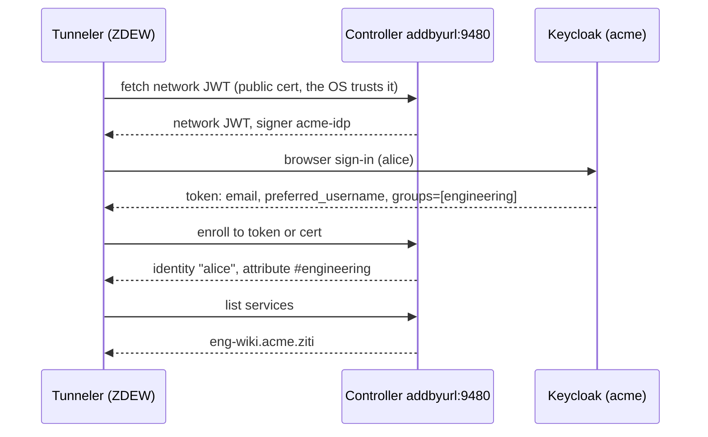
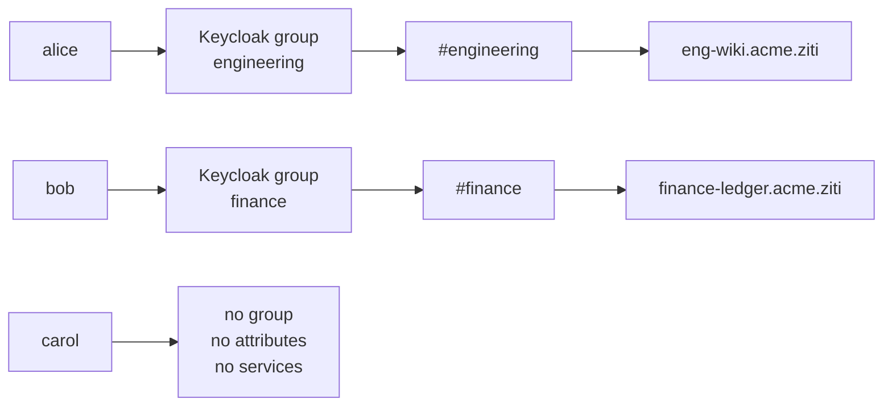

# Diagrams

## Where everything runs

```mermaid
flowchart LR
  subgraph cdaws["cdaws (3.18.113.172)"]
    ctrl["Controller<br/>addbyurl:9480 (Let's Encrypt)<br/>addbyurl-ctrl:9480 (private PKI)"]
    router["Router<br/>addbyurl-router:9490"]
    kc["Keycloak, realm acme<br/>addbyurl-idp:9680"]
    host["acme-host<br/>ziti-edge-tunnel run-host"]
    eng["whoami-eng"]
    fin["whoami-fin"]
    host --> eng
    host --> fin
  end
  sg4["SG4<br/>ZDEW: alice<br/>ziti-edge-tunnel -P ziti-tv: carol"]
  vm["claudevm<br/>ZDEW: bob"]
  mac["M1 mini<br/>ZDEW: alice"]
  sg4 --> ctrl
  vm --> ctrl
  mac --> ctrl
  sg4 -.sign in.-> kc
  vm -.sign in.-> kc
  mac -.sign in.-> kc
  sg4 --> router
  vm --> router
  mac --> router
  router --> host
```

## Joining with a URL

```mermaid
sequenceDiagram
  participant T as Tunneler (ZDEW)
  participant C as Controller addbyurl:9480
  participant K as Keycloak (acme)
  T->>C: fetch network JWT (public cert, the OS trusts it)
  C-->>T: network JWT, signer acme-idp
  T->>K: browser sign-in (alice)
  K-->>T: token: email, preferred_username, groups=[engineering]
  T->>C: enroll to token or cert
  C-->>T: identity "alice", attribute #35;engineering
  T->>C: list services
  C-->>T: eng-wiki.acme.ziti
```

## Groups become access

```mermaid
flowchart LR
  ge["Keycloak group<br/>engineering"] --> ae["#35;engineering"] --> se["eng-wiki.acme.ziti"]
  gf["Keycloak group<br/>finance"] --> af["#35;finance"] --> sf["finance-ledger.acme.ziti"]
  alice --> ge
  bob --> gf
  carol --> nothing["no group<br/>no attributes<br/>no services"]
```

Groups are copied once, when the identity is created. Later changes in Keycloak do not reach OpenZiti.
